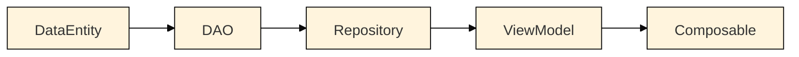
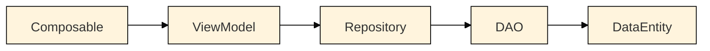

# Hel Quest App

This application was developed as school project for Mobile Application Development Project course of Metropolia University of Applied Sciences in Fall 2024 by

[**Anna Lindén**](https://github.com/AnnaLinden), [**Dung Pham**](https://github.com/dungdpham), [**Artur Golavskiy**](https://github.com/arturgola) and [**Arman Yerkeshev**](https://github.com/A-Yerkeshev)

### Table of contents:

- [Features](#features)
- [Technologies](#technologies)
- [Architecture](#architecture)
  - [Data flow](#data-flow)
  - [Database structure](#database-structure)
  - [Project structure](#project-structure)
- [Contributing](#contributing)
- [Known bugs](#known-bugs)
- 
## Features

|  |  |  |  |
| :----------------------------------------------------------------------------------------------: | :--------------------------------------------------------------------------------------------------------------: | :------------------------------------------------------------------------------------------------: | :----------------------------------------------------------------------------------------------------------------: |

Application contains several quests, consisting of checkpoints, associated with tasks. User can select a quest to follow and perform quest tasks as he progresses. Tasks can be completed in any order. Upon completion of the whole quest user receives an achievement.

Checkpoints are displayed on the map, along with user's current location marker, which updates in real-time.

User needs to be physically present on a location in order to start the task. Currently, only type of quest tasks supported is to take a picture with phone's camera. But in theory, these can be for example, “answer some question about landmark”, "record an audio of the ambiance " etc.

The Hel Quest app incorporates the official Helsinki city colors into its design to ensure the app aligns with local aesthetics. This approach was chosen because the app is intended for local use, and using the city’s official colors helps integrate the product into the local environment in a more meaningful way. The design aligns with Helsinki's identity and provides a more personalized and familiar experience for users in the city.

## Technologies

Programming language of this project is Kotlin v1.9.0

Interactions with the database are handled using Room database. You can find documentation [here](https://developer.android.com/jetpack/androidx/releases/room). All data is saved in phone's local memory. Additionally, Room requires an annotation processor, which, for this project, is KSP.

Interface is created using [Jetpack Compose](https://developer.android.com/compose) toolkit.

Application uses Open Street Map, version for [Composable](https://github.com/utsmannn/osm-android-compose) (credit goes to [utsmannn](https://github.com/utsmannn)).

For camera, CameraX is used. Documentation can be found [here](https://developer.android.com/media/camera/camerax).

Lastly, [JUnit 4](https://junit.org/junit4/) is used for instrumented tests.

## Architecture

### Data flow

Application adheres to MVVM (Model-View-ViewModel) architecture. Data flow from database to UI looks like this:



Data is transmitted using Kotlin [Flows](https://developer.android.com/kotlin/flow). This enables UI to automatically recompose every time data changes.
When user performs some action, which requires update in the database, data flows in reversed direction:



This time, data is passed as [DataEntities](https://developer.android.com/training/data-storage/room/defining-data).

### Database structure

Logical structure of data models is expressed in the following picture. Actual implementation is handled by Room dependency, whose documentation can be found [here](https://developer.android.com/jetpack/androidx/releases/room).


Quests are collections of unordered locations (Checkpoints), at which user is expected to perform certain tasks. Quests have names, descriptions and belong to a category (can be anything). System keeps track of whether or not quest was completed and if so, when. Only one quest can be active at a time.

Checkpoints represent locations, to which user needs to arrive in order to progress with the quest. Checkpoints have names, geo-coordinates and an indicator, whether or not checkpoint is completed. Checkpoint can belong to only one quest. Orphan checkpoints are not allowed. Checkpoints can, optionally, have tasks associated with them.

Tasks describe what actions are required from user. They can have a type, denoting which sort of action is expected from user (ex. take a picture, record an audio, answer a question etc.) Additionally, they can hold an answer to the question, when applicable, which can be used to validate user's response. Currently, both `type` and `answer` properties are <ins>not in use</ins>. Tasks can belong to only one checkpoint. Orphan tasks are not allowed.

### Project structure

```
|--- com.example.androidproject
	|--- data
		|--- daos
		|--- models             // i.e. Room Entities
	|--- repository
	|--- ui
		|--- components         // UI elements, used in screens
		|--- navigation
		|--- screens            // Logically independent composables, used in navigation
		|--- theme              // Colours, shapes etc.
		|--- viewmodels
	|--- utils
```

## Contributing

In order to start working on this project you will need Android Studio. Download it from [here](https://developer.android.com/studio).
Set up Android Studio. For Windows, you can follow [this](https://www.geeksforgeeks.org/guide-to-install-and-set-up-android-studio/) guide.

Download this project as .zip and extract or clone it using this command:
`git clone git@github.com:A-Yerkeshev/android-project.git`

Open project in Android Studio, go to "Gradle Scripts" -> build.gradle.kts. If Android Studio is configured correctly, you will see the top bar with "Sync Now" option. Click it and wait until sync finishes.

You can launch the application on emulator, inside Android Studio (see instructions [here](https://developer.android.com/studio/run/emulator)) or on real Android phone (instructions [here](https://developer.android.com/codelabs/basic-android-kotlin-compose-connect-device#2)). Note, that application's target Android API is **31**, so if you have smaller version, it might not function correctly.

## Known bugs
Map is zoomable only with **+** and **-** buttons - when zooming with gesture new zooming level is not remembered and zoom level is rolled back upon next map's recomposition.
Related problem - when scrolling the map quickly app doesn't keep up and might not remember the last position and roll back slightly upon next recomposition.

