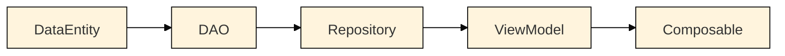
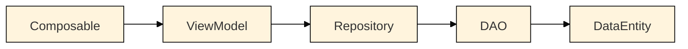

# Hel Quest App
This application was developed as school project for Mobile Application Development Project course of Metropolia University of Applied Sciences in Fall 2024 by

[**Anna Lindén**](https://github.com/AnnaLinden), [**Dung Pham**](https://github.com/dungdpham), [**Artur Golavskiy**](https://github.com/arturgola) and [**Arman Yerkeshev**](https://github.com/A-Yerkeshev)

### Table of contents:
- [Features](#features)
- [Technologies](#technologies)
- [Architecture](#architecture)
  - [Data flow](#data-flow)
  - [Database structure](#database-structure)
  - [Project structure](#project-structure)
- [Contributing](#contributing)

## Features
## Technologies
## Architecture
### Data flow
Application adheres to MVVM (Model-View-ViewModel) architecture. Data flow from database to UI looks like this:



Data is transmitted using Kotlin [Flows](https://developer.android.com/kotlin/flow). This enables UI to automatically recompose every time data changes.
When user performs some action, which requires update in the database, data flows in reversed direction:

This time, data is passed as [DataEntities](https://developer.android.com/training/data-storage/room/defining-data).
### Database structure
Logical structure of data models is expressed in the following picture. Actual implementation is handled by Room dependency, whose documentation can be found [here](https://developer.android.com/jetpack/androidx/releases/room).


Quests are collections of unordered locations (Checkpoints), at which user is expected to perform certain tasks. Quests have names, descriptions and belong to a category (can be anything). System keeps track of whether or not quest was completed and if so, when. Only one quest can be active at a time.

Checkpoints represent locations, to which user needs to arrive in order to progress with the quest. Checkpoints have names, geo-coordinates and an indicator, whether or not checkpoint is completed. Checkpoint can belong to only one quest. Orphan checkpoints are not allowed. Checkpoints can, optionally, have tasks associated with them.

Tasks describe what actions are required from user. They can have a type, denoting which sort of action is expected from user (ex. take a picture, record an audio, answer a question etc.) Additionally, they can hold an answer to the question, when applicable, which can be used to validate user's response. Currently, both `type` and `answer` properties are <ins>not in use</ins>. Tasks can belong to only one checkpoint. Orphan tasks are not allowed.
### Project structure
```
|--- com.example.androidproject
	|--- data
		|--- daos
		|--- models             // i.e. Room Entities
	|--- repository
	|--- ui
		|--- components         // UI elements, used in screens
		|--- navigation
		|--- screens            // Logically independent composables, used in navigation
		|--- theme              // Colours, shapes etc.
		|--- viewmodels
	|--- utils
```

## Contributing